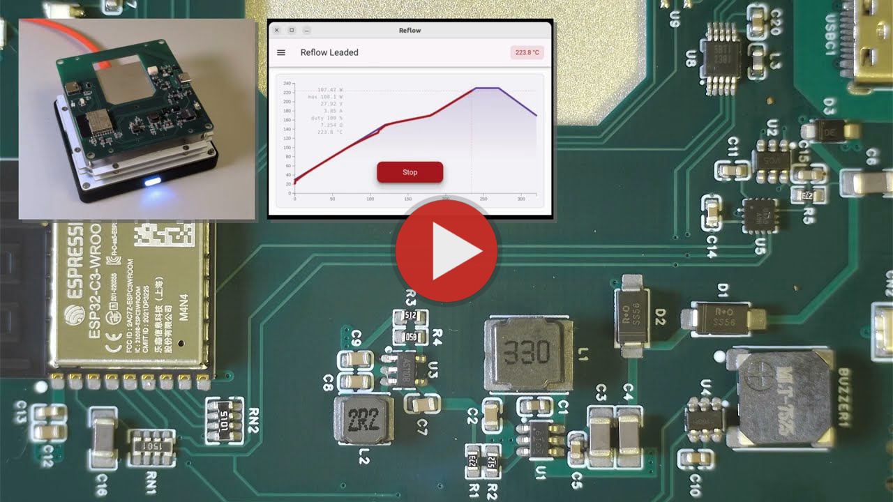
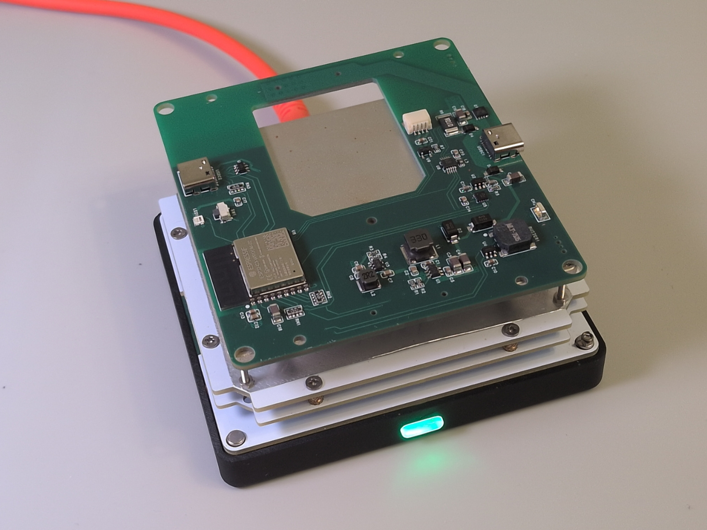

Reflow Micro Table
==================

> Compact Bluetooth-controlled reflow table with an 80x70 mm working area.
> Built for hobby projects when you do not want a bulky professional machine
> taking over your desk.

- [Documentation](doc/README.md)
- [EasyEDA project page](https://oshwlab.com/puzrin/reflow-table-pd) -
  Schematic & PCB. Order almost everything in a couple of clicks.
- [Hackaday.io](https://hackaday.io/project/204503-reflow-micro-table) page.

   
  

## Description

This table is meant for hobbyists who assemble PCBs from time to time. It may
not be as feature-packed as professional gear, but it's compact and covers most
hobby needs.

Key points:

- Very compact and easy to store when not in use.
- Powered from a 100-140 W USB PD charger.
- Controlled from a web browser (desktop and mobile).
- 80x70 mm working area.
- Components cost about 85$ with the simple MCPCB heater, 105$ with the MCH
  heater.
- Simple heating profile management.
- Up to 180°C with the simple MCPCB-based head.
- Up to 250°C with the MCH-based head.

Use cases:

- Reflow soldering with Sn42Bi58 (138°C) paste using the MCPCB-based head.
- Pre-heating (130-150°C) for hot air work.
- Reflow soldering with Sn63Pb37 (183°C) paste using the MCH-based head.
- Other tinkering, like drying parts or baking paint.

> [!NOTE]
>
> This project was built to set a higher standard in this class. It also shows
> beginners that the technologies behind modern electronics are accessible
> today. Even at home, it is now possible to build complex devices that match
> factory-made products, and in some cases go beyond them.
