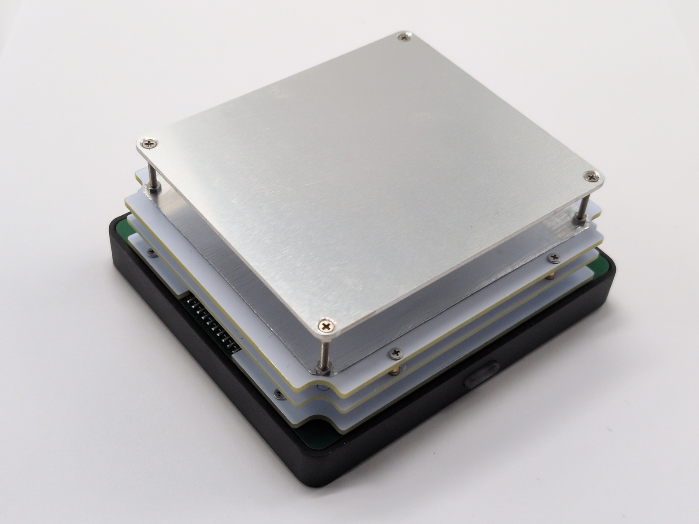

Reflow Micro Table
==================

> Compact reflow soldering table with Bluetooth control, an 80x70 mm working
area. Built for hobby projects when you don't want a bulky professional machine
taking over the desk.

- [Documentation](doc/README.md)
- [EasyEDA project page](https://oshwlab.com/reflow/reflow-usb-pd-headless) -
  Schematic & PCB. Order almost everything in a couple of clicks.
- [Hackaday.io](https://hackaday.io/project/204503-reflow-micro-table) page.

 

## Description

This table is meant for hobbyists who assemble PCBs from time to time. It may
not be as feature-packed as professional gear, but it's compact and covers most
hobby needs.

Key points:

- Very small, doesn't eat much space when not in use.
- Powered from a 100-140 W USB PD charger.
- Controlled from a web browser (desktop and mobile).
- 80x70 mm working area.
- Components cost under $50.
- Simple heating profile management.
- Up to 180°C with the simple MCPCB-based head.
- Up to 300°C with the MCH-based head.

Use cases:

- Reflow soldering with Sn42Bi58 (138°C) paste using the MCPCB-based head.
- Pre-heating (130-150°C) for hot air work.
- Other tinkering, like drying parts or baking paint.

This project isn't unique on the market, but the feature balance is tuned for
fun hobby use and learning. The goal is to be useful and show that building
modern electronics at home is totally doable, even for beginners.
