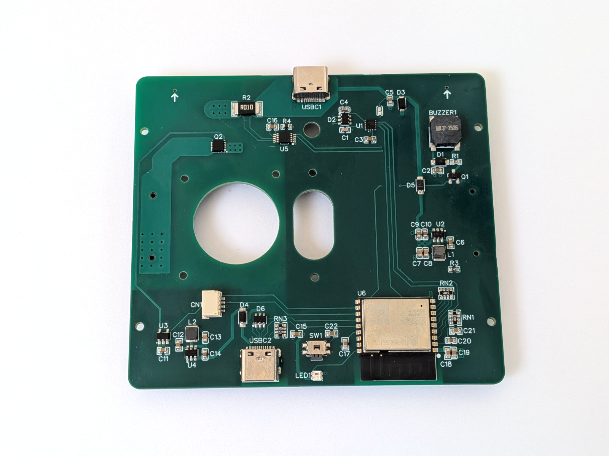
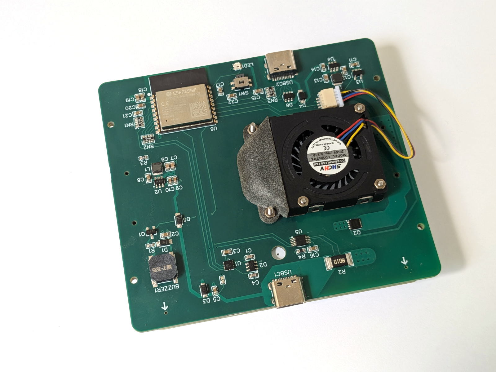
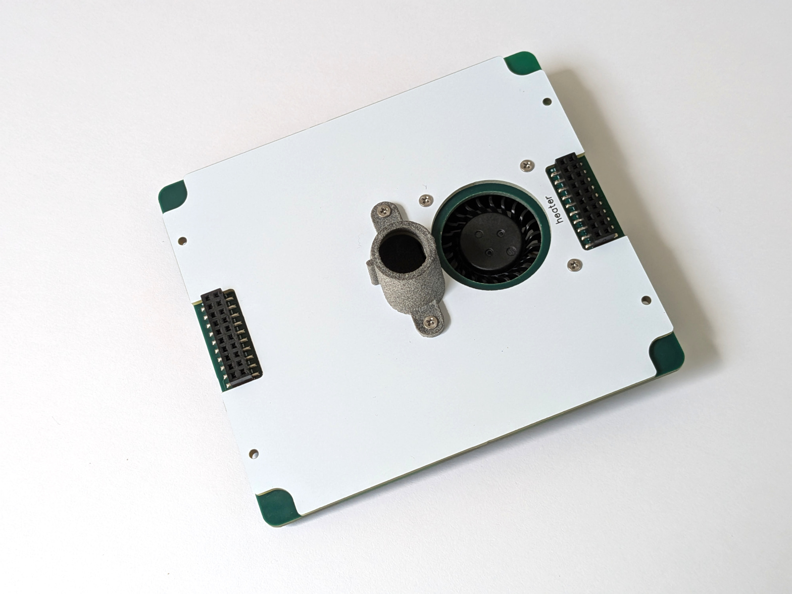

Device assembly <!-- omit in toc -->
===============

- [Required components](#required-components)
  - [General](#general)
  - [Other (optional)](#other-optional)
- [JLCPCB / LCSC order notes](#jlcpcb--lcsc-order-notes)
- [PCB assembly](#pcb-assembly)
- [Firmware upload](#firmware-upload)
- [Heater assembly](#heater-assembly)
- [Case](#case)
- [Calibration](#calibration)
  - [Temperature sensor](#temperature-sensor)
  - [ADRC controller](#adrc-controller)

## Required components

### General

&nbsp; | Name | Comment
-------|------|--------
1 | [PCB & Components](https://oshwlab.com/reflow/reflow-usb-pd-headless) | Go to EasyEda project page and order both in couple of clicks. If you order PCB first, components second - you will be able to join delivery. Add rocker switch below to LCSC order.
2 | [22 AWG wire](https://www.aliexpress.com/item/1005003732230847.html) | SMT stencil positioning.
3 | [M1.6 SS screws 18mm, cone cap](https://www.aliexpress.com/item/32946954901.html) | DIN965/GB819. Mount heater plate to reflector. Should be stainless steel, important!
4 | [M1.6 black screws 8mm, cone cap](https://www.aliexpress.com/item/32431305716.html) | DIN965/GB819. MCH & RTD mount.
5 | [M1.6 screws 3mm, flat cap](https://www.aliexpress.com/item/4000308042674.html) | Mount head reflector to head base.
6 | [M1.6 screws 12mm, flat cap](https://www.aliexpress.com/item/4000308042674.html) | Fan mount.
7 | [M1.6 screws 5m, flat cap](https://www.aliexpress.com/item/4000308042674.html) | PCB mount.
8 | [M1.6 SS spring lock washers](https://www.aliexpress.com/item/32975233438.html) | MCH mount.
9 | [M1.6 SS nuts](https://www.aliexpress.com/item/1005007593861199.html) | MCH mount.
10 | [M1.6 brass insert nuts](https://www.aliexpress.com/item/1005008644449489.html) | MCH mount.
11 | [MCH 70*14 1R](https://www.aliexpress.com/item/32966428374.html) | 2 heaters required, but buy 5-10 to match resistance.
12 | [Soft silicone wire, 30 AWG, white](https://www.aliexpress.com/item/4001283806251.html) | RTD  mount.
13 | Aluminum foil, 50μm (0.05mm) | Heater reflector. Such foil is sold for sauna insulation. You can also use foil from baking forms.
14 | [Thermal conductive paste](https://www.aliexpress.com/item/1005006085448629.html) | [Alternate](https://www.aliexpress.com/item/32870824982.html). Should work at 300°C. Don't try cheap ones.
15 | [Magnets 6x6mm](https://www.aliexpress.com/item/1005005114069840.html) | Cap lock. If buy in other place - check height and adjust case appropriately.
16 | [esp32-c3](https://www.aliexpress.com/item/1005004386637738.html) (optional) | If not available at LCSC, model ESP32-C3-WROOM-02-N4.
17 | Black paint | High temperature paint, aerosol (used for barbecue / stovespray), to cover heating plate top.

Note. You are strongly advised to order SMT stencil for your PCB. That will
add ~ 8$ in total to your order - good price for convenience.

### Other (optional)

&nbsp; | Name | Comment
-------|------|--------
1 | 100W USB PD changer with PPS | 21v/5A PPS profile required. [Voltme 100W](https://www.aliexpress.com/item/1005004624922429.html), [Voltme 140W](https://www.aliexpress.com/item/1005004777502660.html), [Essager 100W](https://www.aliexpress.com/item/1005006436990810.html). If you prefer different one - make sure required power profile is supported, that's important.
2 | [Digital thermometer](https://www.aliexpress.com/item/32815540975.html) | [Alternate](https://www.aliexpress.com/item/32803473451.html) | For temperature calibration.
3 | [Soldering air gun](https://www.aliexpress.com/item/1005006099512955.html) | For PCB assembly.
4 | [Low temp soldering paste](https://www.aliexpress.com/item/1005006023229246.html) | Sn42bi58, 138°C, for PCB assembly. [Alternate](https://www.aliexpress.com/item/1005006724027713.html).
5 | [Milliohm meter](https://www.aliexpress.com/item/1005006408703765.html) | For MCH heaters pairing. 5v PD trigger recommended for convenient 5v power from USB.
6 | [Dental diamond disk](https://www.aliexpress.com/item/4001138228461.html) | For SS clamps cut. Don't forget to buy mandrel.
7 | 217°C soldering paste | Solder RTD wires
8 | 138°C soldering paste | Solder everything except RTD

## JLCPCB / LCSC order notes

https://oshwlab.com/reflow/reflow-usb-pd-headless

1. PCB_main: 1.6mm, green (other colors for 4-layer PCB are expensive).
   - Option "Remove mark".
   - Stencil strongly recommended.
     - Bottom side only.
     - Comment "**Make stencil according to paste mask file and don't forget corner holes, marked with arrows**". Or positional holes can be missed.
     - Select "custom size", and set 90\*80. Then stencil will be compact and
       light, with small delivery cost.
2. PCB_cap: 1.6mm, white.
   - Option "Remove mark".
   - Comment: "PCB has no traces, mask only."
3. hotplate_base: 1.2mm, white.
   - Option "Remove mark".
4. hotplate_reflector: 1.6mm, white.
   - Option "Remove mark".
   - Comment: "PCB has no traces, mask only."
5. MCH mount: aluminum, 1.2mm
   - Option "Remove mark".
   - Comment: "This PCB has no traces and no mask."
6. foil_conductor: 1.0mm, red.
   - Comment: "PCB has no traces, mask only."

jlc3dp, CNC:

1. Hotplate:
   - Material: Aluminum 6061.
   - Surface Finish: "Bead blasting".
   - Comment: "Don't deburr".

jlc3dp, printed:

1. tray & cap: SLA "black resin" or MJF "PA12-HP nylon".
2. button: SLA "8001 resin", translucent.
3. tool_spacer: SLA "black resin", 2x
4. pcb_aligner: SLA "black resin", 4x
5. air_duct: MJF "PA12-HP nylon", non-painted (natural color).

## PCB assembly

Pin SMT stencil and PCB with 22 AWG wire to silicon pad. You can also any soft
surface - beer cork pads, for example.

Apply soldering paste. Use enough paste, to apply with single move of plastic
card. If you move card over SMT stencil holes multiple times - paste can be
overdosed, and some pins can be shorted.

Place SMD components and solder all with air gun. Inspect result and fix defects
with soldering iron (and flux) if needed. If you plan to clean PCB from flux in
ultrasonic bath - postpone buzzer mount to avoid damage.

**Note 1**. Use low temperature (138°C) paste to simplify process and minimize
mistakes.

**Note 2**. You can use cheap preheater like [this](https://www.aliexpress.com/item/1005007009784987.html)

Use main PCB to solder heating head connectors. See [separate manual](./heater_assembly.md)
for details.

Then install fan, air conductor and PCB cap (use 12mm screws).

 

## Firmware upload

TBD

## Heater assembly

[See in separate file](./heater_assembly.md).

## Case

TBD

## Calibration

For proper work, you need should setup temperature sensor and temperature
regulator (ADRC controller). That's doable at `Settings` page.

### Temperature sensor

For heating heads with RTD sensor, you need to set only real room temperature.

For heads without sensors 2 points must be set - first with room temperature,
and second with high temperature. Open application, connect your device, go to
settings and press calibration button.

- **Step 1**. Make sure device is "cold", and enter room temperature.
- **Step 2** (only for heads without RTD). Press button to start heating with
  suggested power (50-70W), and wait until temperature become stable (you will
  see approximate value). Then, place a small peace of solder on the table, and
  put temperature sensor into it. Enter the real value, showed by thermometer.

*Note. It's important to use solder drop for temperature measure instead of
direct touch. K-pair sensor has a small ball on the end - contact surface
without solder will be very small, that will cause notable errors.*

### ADRC controller

Device defaults are reasonably good for 80x70x3mm plates. But if you need
another size, you can recalibrate ADRC controller.

TBD
