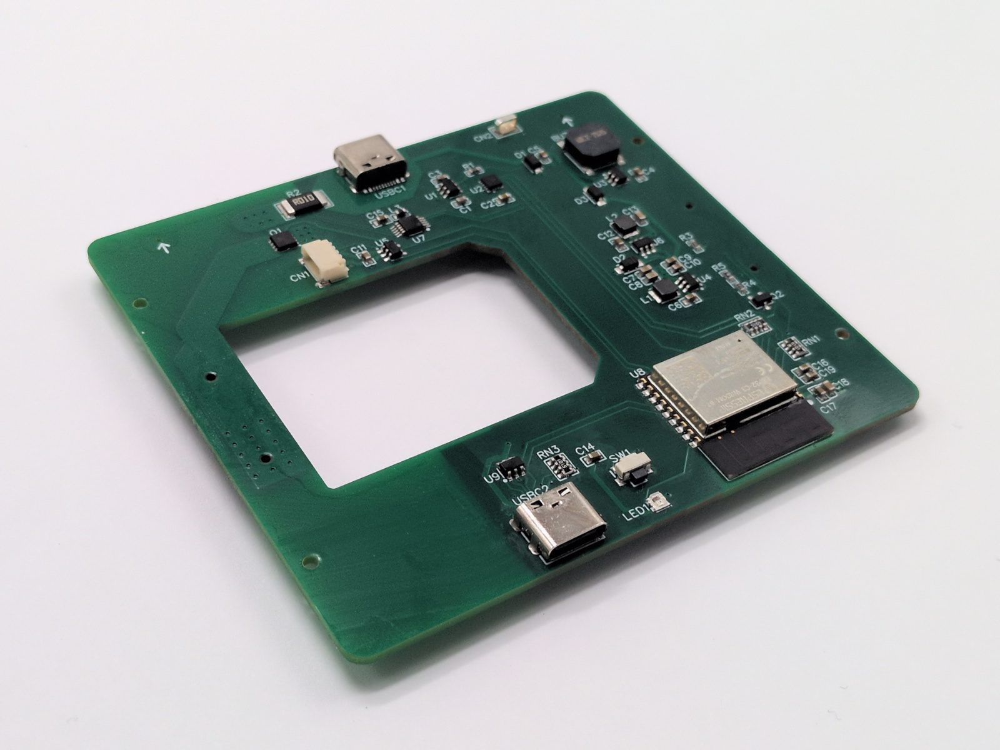
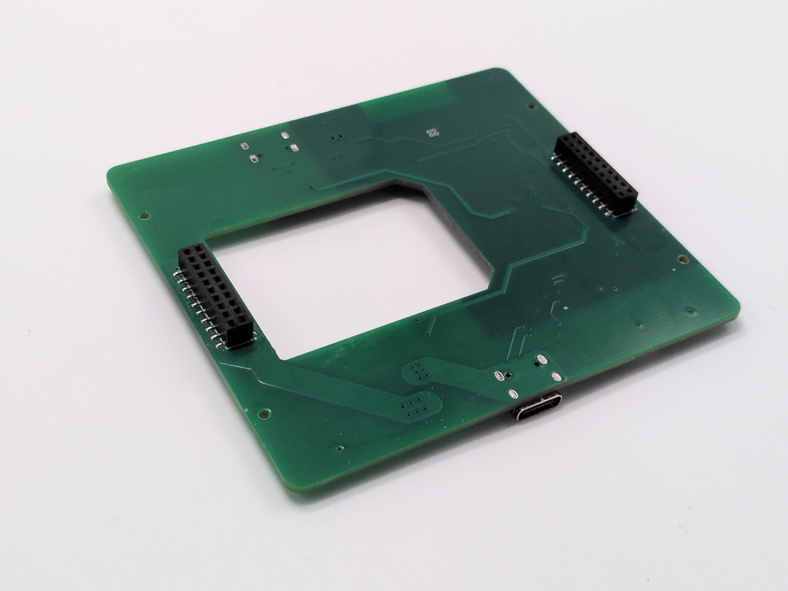
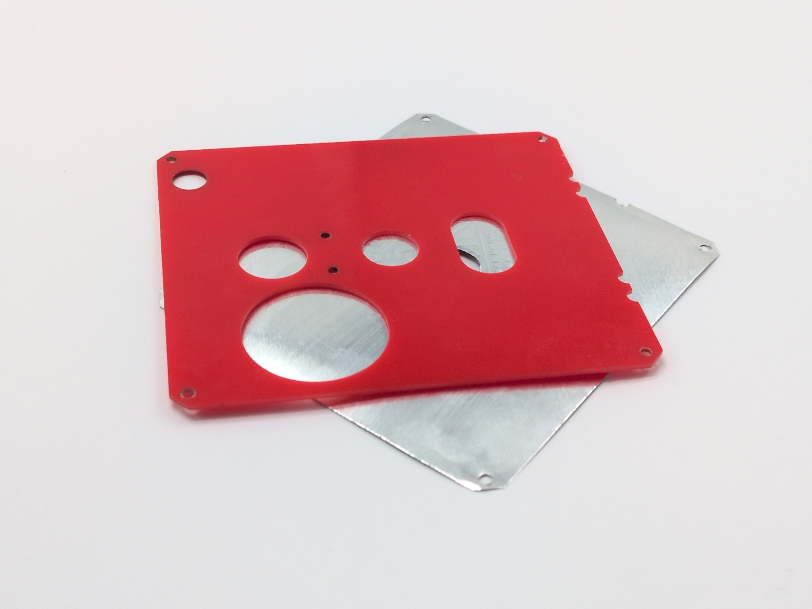
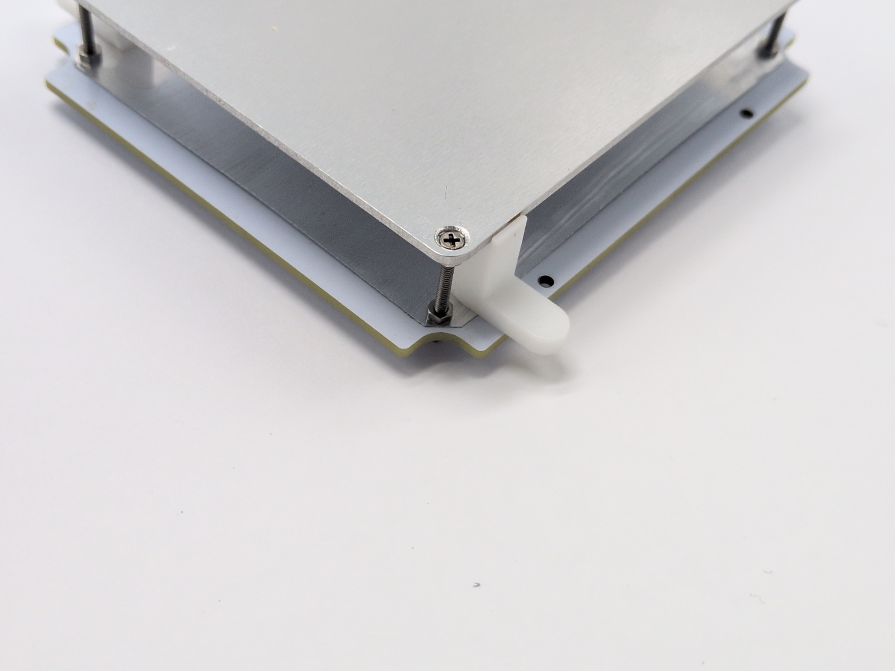
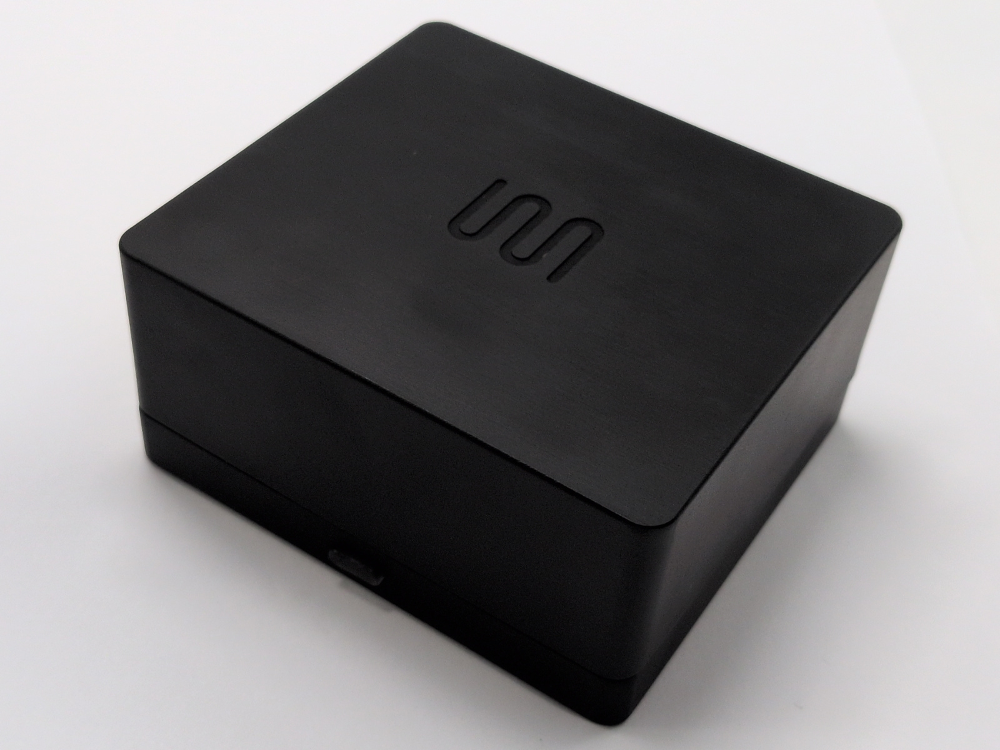

Device build <!-- omit in toc -->
============

- [PCB assembly](#pcb-assembly)
- [Heater assembly](#heater-assembly)
- [Case](#case)
- [Firmware upload](#firmware-upload)
- [Final assembly](#final-assembly)

## PCB assembly

Pin the SMT stencil and PCB to a silicone pad with a loop of 22 AWG wire. Any
soft surface works (beer cork pads are great too).

Spread solder paste. Load enough paste so you can sweep it through the stencil
in a single pass with a plastic card. Multiple passes tend to overload the
openings and can short nearby pins.

Place the SMD parts and solder everything with a hot-air gun. Inspect the board
and fix any issues with a soldering iron and flux. If you're going to wash the
PCB in an ultrasonic bath, leave the buzzer off until after cleaning so it
stays safe.

Then solder the heating head connectors on the top side of the PCB. Also solder
the USB connector mounting holes.

 

**Tip:** Use low-temperature (138°C) paste to keep the process easy and minimize
mistakes.

When you're done, install the fan and air duct on the PCB cover with the 10 mm
screws.

 

## Heater assembly

Start by positioning the head connector accurately.

- Place the male connector on the main board sockets. Do not press it in yet.
- Add the alignment conductors on the corners and rest the head base on top.
- Tack the edge pins on the outer side to lock the position.

 

Remove the head base, populate the remaining components, and solder them. Short
the RTD pins to enable the TCR-based temperature sensor.

Continue with the hotplate. Countersink the screw heads with a zero-flute
countersink.

- Set the countersink angle so it touches both rails of the drilling conductor
  evenly. Shift the conductor if needed.
- If you use a screwdriver, drill freehand while resting the countersink on the
  conductor and pressing through the hole; this keeps the angle correct.
- Run at the lowest speed and clear chips often so they do not scrape the
  conductor.
- Check the depth: insert a screw and slide the conductor above it—the screw
  must not catch on anything.

Then install the rest of the hotplate components.

- Use RoHS 217°C paste; it is important.
- Use 0.6 mm copper wire for the power lines.
- Tin the wire first, then solder it to the hotplate.
- Use a large iron tip at 350-400°C so there is enough heat.
- Clean the flux with IPA.
- Install the corner screws with spring washers.

Prepare the foil reflector layer.

- Place the foil on a flat surface with the template on top.
- Cut the foil along the template outline and the central hole with a knife.
- Secure the foil to the template with tape to prevent shifting.
- Punch the mounting holes by pressing through with a screw.
- Clean up the foil burrs around the holes by scraping with a tilted screw.

Install the foil and frame on the hotplate.

- Use spacers to set a 12 mm gap between the heater top and the reflector.
- For each corner, insert the spacer, snug the top nut first, then tighten
  the bottom nut; spring lock washers go underneath.

 

Attach the hotplate base.

- Install the 4 mm insert nuts with the 3 mm screws into the heating head base.
- Solder the hotplate power wires.
- Clean the flux with IPA.

## Case

### Heat-set inserts (for nylon) <!-- omit in toc -->

If you have a nylon case with holes for heat-set inserts, install them first.
This is much easier than gluing. A dedicated soldering iron tip works best.

If you don't have one, try threading an M2 10 mm screw into the insert and
pressing down on it with the iron tip. Add solder to the tip for better heat
transfer. Set the temperature to about 200°C.

### Bonding parts <!-- omit in toc -->

Install the magnets (and insert nuts for ordinary plastic) into the case. For
ordinary plastics, a CA gel or UV glue can work in a pinch, but PA-12 nylon
needs a dedicated PA adhesive. Do not rely on general-purpose glues; they will
not bond well. In general, it's better to use the same nylon glue type for
other plastics.

- Check the glue datasheet: it must be rated for PA/Nylon (low-energy surfaces).
- Because we bond metal to plastic, the glue should stay slightly flexible. MMA
  adhesives work best.
- In a pinch, you can try a slow epoxy (not recommended). Avoid "metal-filled"
  epoxies; they are too rigid and can crack after temperature changes. Also
  avoid fast epoxies and prefer ones with a static mixer for easier work.
- MMA glue often comes in tubes. It is highly recommended to transfer it into
  a cartridge with a static mixer for easier application.

Prep the parts before bonding:

- Degrease the magnets with IPA and stack them so their orientation stays
  consistent.
- Thread screws into the insert nuts to protect the threads and make handling
  easier.
- Make sure the nuts slide fully into the tray holes without force.
- Check the magnet height. Trim the support pins if needed.

Bonding steps:

- Use a mini electronics vise to hold the case. It is convenient and reduces
  the risk of getting resin on the case.
- Apply glue to each insert nut and press it into the holes.
- One by one, apply enough glue to each tray corner, place the magnet, and use
  the printed clamp until the glue hardens.
- Reverse the magnet stack and repeat for the cap, double-checking the
  orientation.
- Check that the case is clean. If you accidentally get resin on it, wipe it
  off with a cloth.

 

### Install tray pads <!-- omit in toc -->

After the glue has cured, install the silicone feet on the bottom of the case.

## Firmware upload

1. Install [VS Code](https://code.visualstudio.com/).
2. Clone this repo or download the zip archive and unpack it anywhere.
3. Open the `firmware/` folder. When VS Code prompts you to install extensions,
   accept everything so PlatformIO and the dependencies are installed.
4. Connect a USB cable to the internal debug connector (next to the LED/button).
5. In VS Code, open the PlatformIO tab (left sidebar), then run
   `PROJECT TASKS` -> `main` -> `General` -> `Upload`. Wait for the build to
   finish; it can take a while. The device beeps when the upload completes.

Now assemble everything and move on to calibration.

## Final assembly

Drop the button into the tray, then mount the main board and board cover with
the 6 mm screws.

Then insert the head and you're ready to go!

 

Now proceed to [calibration](./calibration.md).
