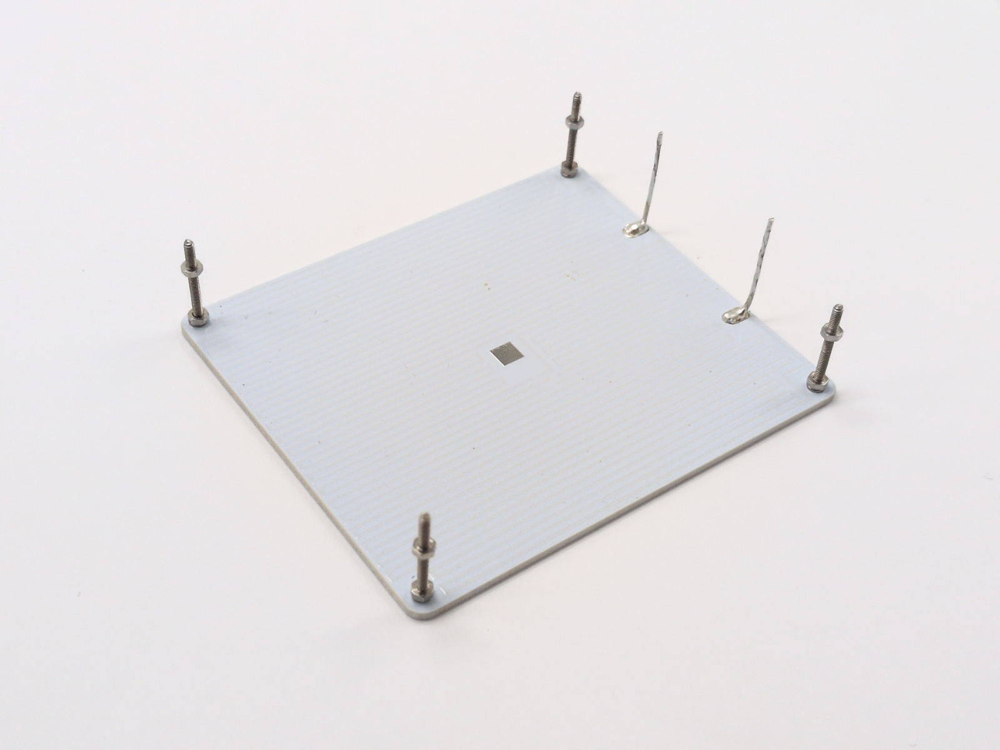
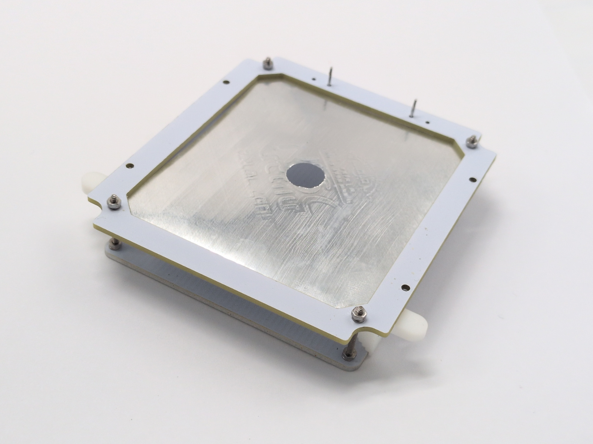

Device build <!-- omit in toc -->
============

- [PCB assembly](#pcb-assembly)
- [Heater assembly](#heater-assembly)
- [Case](#case)
- [Firmware upload](#firmware-upload)
- [Final assembly](#final-assembly)

## PCB assembly

Pin the SMT stencil and PCB to a silicone pad with a loop of 22 AWG wire. Any
soft surface works (beer cork pads are great too).

Spread solder paste. Load enough paste so you can sweep it through the stencil
in a single pass with a plastic card. Multiple passes tend to overload the
openings and can short nearby pins.

Place the SMD parts and solder everything with a hot air gun. Inspect the board
and fix any issues with a soldering iron and flux. If you're going to wash the
PCB in an ultrasonic bath, leave the buzzer off until after cleaning so it
stays safe.

Then solder the heating head connectors on the top side of the PCB. And solder
USB connectors mounting holes.

 

**Tip:** Use low-temperature (138°C) paste to keep the process easy and minimize
mistakes.

When you're done, install the fan and air duct on the PCB cover with the 10 mm
screws.

 

## Heater assembly

Start by positioning the head connector accurately.

- Place the male connector on the main board sockets. Do not press it in yet.
- Add the alignment conductors on the corners and rest the head base on top.
- Tack the edge pins on the outer side to lock the position.

 

Remove the head base, populate the remaining components, and solder them. Short
the RTD pins to enable the TCR-based temperature sensor.

Continue with the hotplate. Countersink the screw heads with a zero-flute
countersink.

TBD details

TBD image

Then install the rest of the hotplate components.

- Use 0.5 mm copper wire for the power lines.
- Use RoHS 217°C paste; that is important.
- Tin the wire first, then solder it to the hotplate.
- Use a large iron tip at 350°C so there is enough heat.
- Clean the flux with IPA.
- Install the corner screws with spring washers.

Prepare the foil reflector layer.

- Cut the foil from a baking tray, using the conductor as a template.
- Trim the outline and center opening with a knife.
- Tape the foil in place and press the corner holes with a screw. As the foil
  folds inward, keep the screw in the hole and scrub the edge back and forth—
  the threads shave the excess cleanly.

Install the foil and frame on the hotplate.

- Use spacers to set a 12 mm gap between the heater top and the reflector.
- For each corner, insert the spacer, snug the top nut first, then tighten
  the bottom nut (spring lock washers go underneath).

 

Attach the hotplate base.

- Install the 4 mm insert nuts with the 3 mm screws in the heating head base.
- Solder the hotplate power wires with LTS paste.
- Clean the flux with IPA.

## Case

Install the magnets and insert nuts in the case. For ordinary plastics a CA gel
can work, but PA-12 nylon needs a dedicated PA adhesive. Do not rely on general
purpose glues; they will not bond well.

- Check the glue datasheet: it must be rated for PA/Nylon (low energy
  surfaces).
- Because we bond metal to plastic, the glue should stay slightly flexible. MMA
  adhesives work best.
- In the worst case you can try a slow epoxy (not recommended). Avoid
  "metal-filled" epoxies; they are too rigid and can crack after temperature
  changes.

Prep the parts before bonding:

- Degrease the magnets and stack them so their orientation stays consistent.
- Thread screws into the insert nuts to protect the threads and make handling
  easier.
- Make sure the nuts slide fully into the tray holes without force.
- Check the magnet height. Trim the support pins if needed.

For ordinary plastics, epoxy is still the safest choice, although CA usually
holds. If it fails later, you can always re-bond with epoxy.

- Apply glue to each insert nut and press it into the holes.
- One by one, apply enough epoxy to each tray corner, place the magnet, and use
  the printed clamp until the glue hardens.
- Reverse the magnet stack and repeat for the cap, double-checking the
  orientation.

 

Stick the pads to the tray bottom.

TBD. Tray bottom image

## Firmware upload

1. Install [VS Code](https://code.visualstudio.com/).
2. Clone this repo or download the zip archive and unpack it anywhere.
3. Open the `firmware/` folder. When VS Code prompts you to install extensions,
   accept everything so PlatformIO and the dependencies are installed.
4. Connect a USB cable to the internal debug connector (next to the LED/button).
5. In VS Code open the PlatformIO tab (left sidebar), then run
   `PROJECT TASKS` -> `main` -> `General` -> `Upload`. Wait for the build to
   finish; it can take a while. The device beeps when the upload completes.

Now assemble everything and move on to calibration.

## Final assembly

Drop the button into the tray, then mount the main board and board cover with
the 6 mm screws.

Then insert the head and you're ready to go!

 
