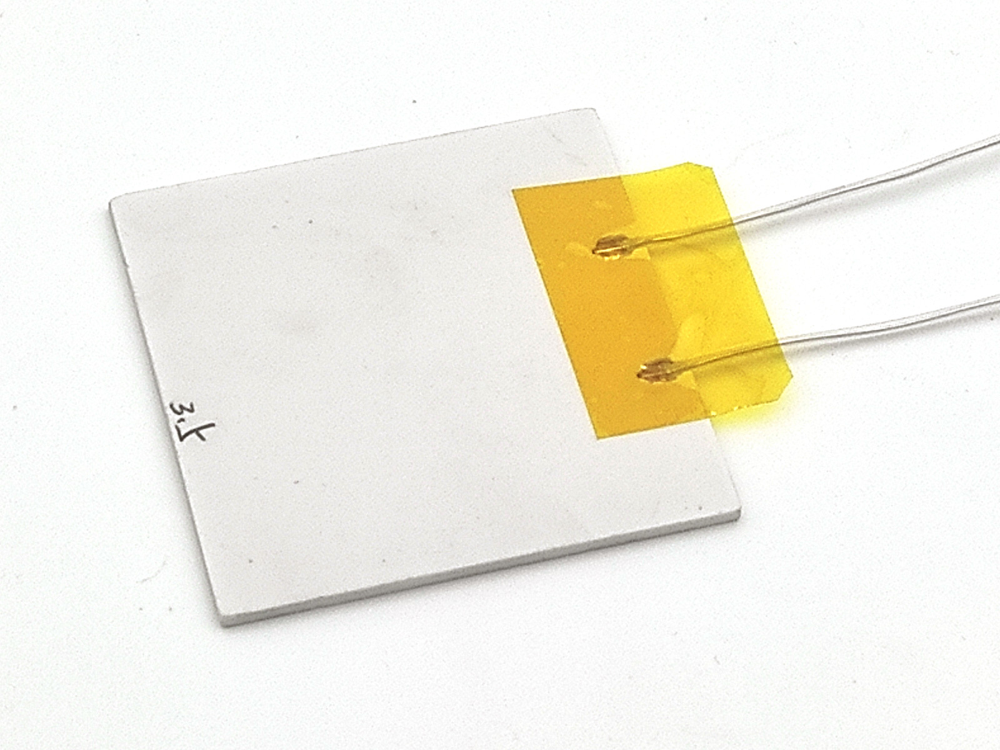
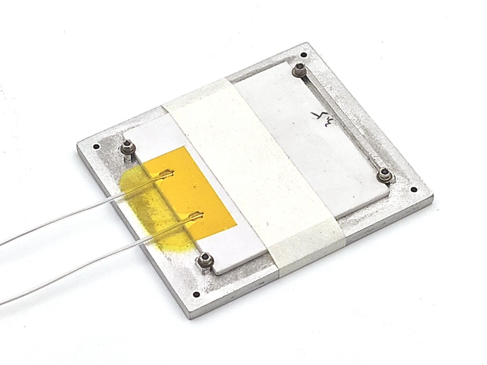
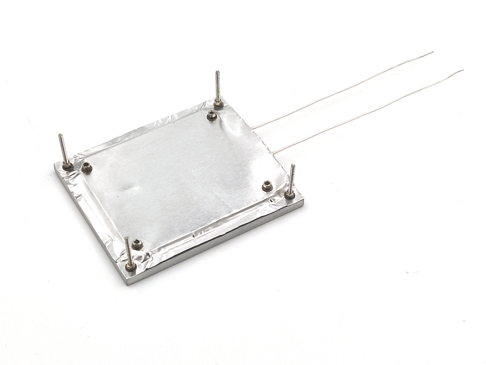

Heater assembly <!-- omit in toc -->
===============

- [MCH pads insulation](#mch-pads-insulation)
- [Sand plate bottom and sides](#sand-plate-bottom-and-sides)
- [Plate assembly](#plate-assembly)
- [Mount the rest](#mount-the-rest)

## MCH pads insulation

Since MCH has open pads and been covered by reflector foil, those should be
insulated. This is done by peace of kapton (polyimide) sticky tape.

## Sand plate bottom and sides

It worth remove anodizing from plate bottom and sides to reduce IR emission.

TBD

## Plate assembly

Here is how heater looks under foil:

You need fat aluminum foil, 0.05mm (50um). Such foil is used for sauna thermal
insulation, and available in appropriate stores. If you can's find it - try foil
from food baking forms (straighten it with something round if needed).

Apply thermal conductive paste to plate, put heater to it's place and stick it
temporary with sticky tape. Note, paste should be ok at high temperature. For
example - Thermal Grizzly Kryonaut.

Cut peace with 1cm reserve from each side and drill inner screw holes with
conductor. Screw it from one side, insert half-huts with tweezers and tighten
the screws. Then remove sticky tape and install 2 other screws in similar way.

After 4 inner screws assembled, smooth the foil, drill corner holes and install
long corner screws:

Don't forget to use spring washers everywhere. That's important to compensate
metal parts size change on heating and cooling.

## Mount the rest

Now mount reflector with space 8mm to plate edge.

TBD

And, final step - mount all on PCB bord with sield.

TBD
