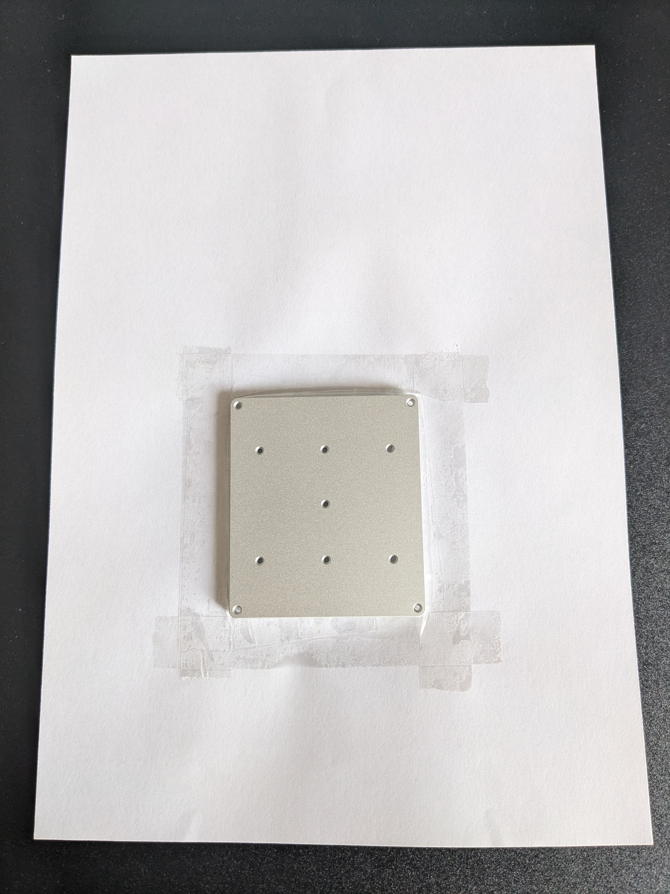
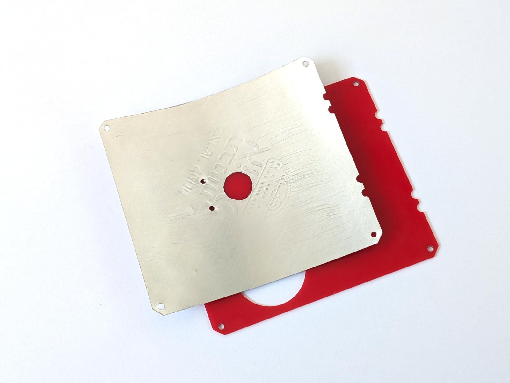

Heater assembly <!-- omit in toc -->
===============

- [Plate top painting](#plate-top-painting)
- [Baking the paint](#baking-the-paint)
- [MCH heaters resistance matching](#mch-heaters-resistance-matching)
- [Cut SS clamps](#cut-ss-clamps)
- [Mount hotplate top parts](#mount-hotplate-top-parts)
- [Mount reflector](#mount-reflector)
- [Mount base](#mount-base)
- [Bake paint](#bake-paint)

## Plate top painting

For good heat emission heating plate top should be painted to black color. Use
high-temp spay for barbecue / stove / engine. Unfortunately, such sprays
are not delivered abroad, and you need to check in local shops.

**Note 1**. Some paints may be for steel only. Test on unused alu peace prior to
use.

**Note 2**. While manufacturers usually advice to bake such paints several
hours, full hardening at high temperature can take up to 2-3 days.

First, protect plate sides with sticky tape, and stick to A4 paper. Clean plate
top with IPA. Then put all on suitable surface and spay paint from 30-40cm
distance. Move sprayer to make thin and uniform layer. Small thickness is
important for big temperature ranges.

 

## Baking the paint

High heat paints need baking after dry. Read details in your paint instruction.

There are 2 approaches to baking:

1. If you have appropriate heater or regulated power source - bake immediately
   after paint dries.
2. Bake after full device assembly, with built-in baking profile. In this case,
   you probably need waiting 1 day after painting for better dry, and be more
   careful to avoid scratches before plate been baked.

Since heads are easy to replace, it may be convenient to assemble 2 heads - one
for baking/experimenting, and one for final use.

Note, many paint manufacturers advice to harden paint at ~200°C for 1 hour. THIS
IS NOT ENOUGH! At room temperature paint will be solid, but can soften after
heating back. Consider alternative baking profile:

- 250°C (max reflow working temp) for 2-3 days (days, that's not a mistake).
- 4°C/min temperature rising speed.

If you are not sure about your paint - check it at test workpiece. Use a
modeling knife to scratch surface with small force.

- Usually, after you bake paint a couple of hours, it becomes scratch-resistant
  at room temperature. But still stays soft at high temp.
- After been baked 2-3 days it becomes harden for high temp too.

Note, this is not professional advice, but personal observation with different
paints.

Why you are adviced to bake longer that recommended? Imagine, you suddenly move
PCB, placed at hotplate, while temperature is high. PCB should not scratch the
paint by accident.

## MCH heaters resistance matching

Since table uses 2 MCH heaters, those should have very close resistance for
balanced work. That's why you need buy heaters with some reserve.

2% tolerance will be good. Use milliohm meter (see table of optional purchases).
For exact result, Kelvin clips should be attached directly to MCH pads.

10 MCH-s should give you 3-4 useable pairs.

## Cut SS clamps

If you printed stainless steel clamps, as been advised, cut those from the whole
print. Use dremel with thin dental diamond disks, those works very well and
precise.

 

## Mount hotplate top parts

- Apply thermal conductive paste to heaters, as small as posible.
- Put heaters on plate, and slide +/-0.5mm for better paste spread.
- Screw everything, using spring washers, with very small effort.

Use 8mm black screws for heaters/RTD and 18mm screw for corners

*Note. DON'T use big force on screws, in other case MCH can crack after heating!*

After all mounted, solder 30mm silicon wires to RTD.

- Use high temperature lead free (217°C) paste.
- Soldering joint should be as small as possible.
- Strip & tin wires, 1-2mm at one end, and 4-5mm at  another end. Then put a few
  pate to short ends and solder to RTD.
- Gently remove flux with IPA, to reduce potential heat absorption.

## Mount reflector

Use conductor to cut foil reflector. Push holes with screw.

Then use spacers to set 12mm interval between heater top and reflector. For each
corner, when spacer inserted, rotate top nut first. Then tighten bottom nuts
(use spring lock washers at bottom side).

 

## Mount base

First, solder connectors. Since those should be positioned very precise, use
conductors.

- Place conductors on the main board corners, and put female connectors on it.
- Connectors should NOT be inserted, only placed at male connector holes.
- Place heater's base board over, and solder some pins to lock position.
- After that, remove heater base and solder all pins.

 

Now time for final head assembly.

- Place 4mm insert nuts with 3mm screws to heating head base.
- Put the base on expected position, and cut MCH wires.
- Detach base and tin MCH wires. Acid flux or iron tip cleaner will be ok.
- Then screw head base to reflector (use 3mm screws)
- Solder MCH and RTD wires.

**Note**. You may need active flux to tin MCH wires. Try "iron tip refresher".
Use small amount and wash after.

Then, push pin terminals into main PCB for right positioning, place heater on
those, and solder.

TBD image.

Wash out flux after soldering.

## Bake paint

sdfs

