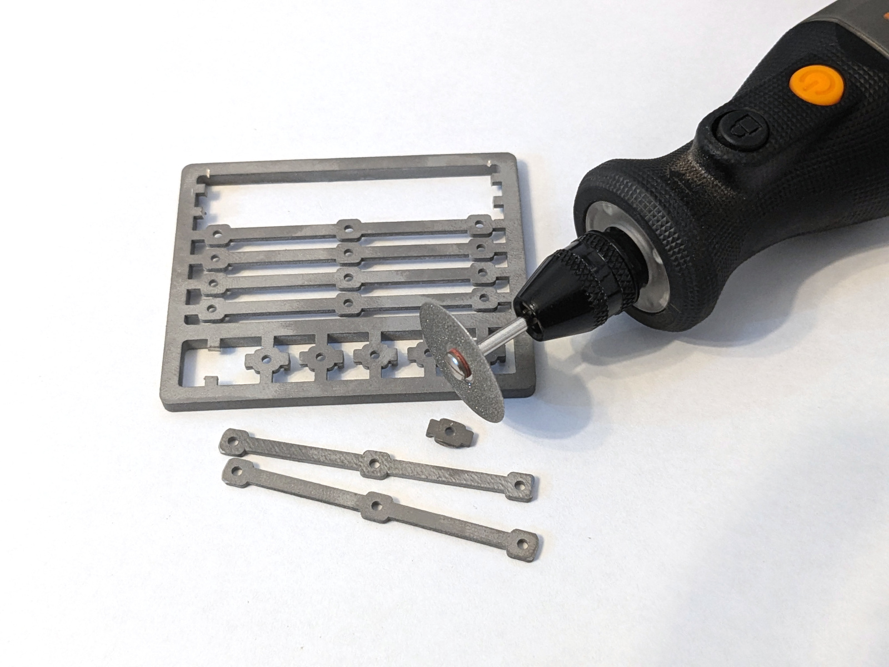
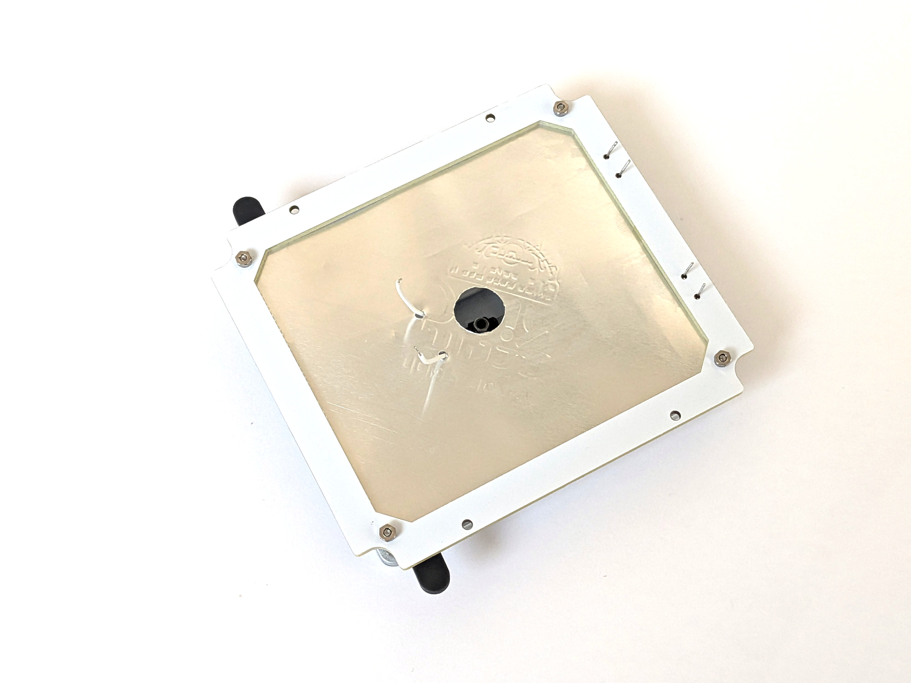

MCH-based heating head <!-- omit in toc -->
======================

- [BOM](#bom)
- [MCH heaters resistance matching](#mch-heaters-resistance-matching)
- [Cut SS clamps](#cut-ss-clamps)
- [Mount hotplate top parts](#mount-hotplate-top-parts)
- [Mount reflector](#mount-reflector)
- [Mount base](#mount-base)

## BOM

This BOM extends the default one; be sure to buy it as well.

&nbsp; | Name | Comment
-------|------|--------
1 | Hotplate and clamps | See details below the table.
2 | [M1.6 SS screws 18 mm, cone cap](https://www.aliexpress.com/item/32946954901.html) | DIN965/GB819. Mount the heater plate to the reflector.
3 | [M1.6 SS screws 8 mm, cone cap](https://www.aliexpress.com/item/32946954901.html) | DIN965/GB819. MCH mount.
4 | [M1.6 SS washers](https://www.aliexpress.com/item/32975217522.html) | Hotplate mount.
5 | [MCH 70*14 2R](https://www.aliexpress.com/item/32966428374.html) | Two heaters are required; buy 5-10 to match their resistance.
6 | [Thermally conductive paste](https://www.aliexpress.com/item/1005002400161049.html) | Use Thermal Grizzly Kryonaut. The paste must handle 300°C, so skip the cheap stuff.
7 | [Milliohm meter](https://www.aliexpress.com/item/1005006408703765.html) | For pairing the MCH heaters.
8 | [Dental diamond disks](https://www.aliexpress.com/item/4001138228461.html) | For cutting the stainless clamps. Grab a mandrel too.

Hotplate (jlc3dp, CNC):

- File `hotplate_80x70x2.8.step`
- Material: Aluminum 6061.
- Surface Finish: "Bead blasting + Anodizing" (Natural color).

MCH mounting (jlc3dp, SS print)

- File `ss_mch_mount.stl`
- `SLM(Metal)` process, 316L steel. Don't try `BJ(Metal)`; it will be rejected.
- Comment: "All defects are acceptable in advance." The design is on the edge
  of the printing requirements, so this comment helps avoid order declines.

## MCH heaters resistance matching

The build uses two MCH heaters, so their resistance needs to match closely for
balanced heating. Buy a few extras so you can pair them.

Aim for roughly 2% tolerance. Use a milliohm meter (see the BOM) and connect
Kelvin clips directly to the MCH pads for accurate readings.

Buying ten heaters typically yields three or four usable pairs.

## Cut SS clamps

Cut the stainless steel clamps free from the panel. A Dremel with thin dental
diamond disks works very well and keeps the cuts precise.

 

## Mount hotplate top parts

- Apply a very thin layer of thermal paste to the heaters.
- Place the heaters on the plate and slide them about +/-0.5 mm to spread the
  paste.
- Tighten the screws with spring washers using only a light touch.

Use 8 mm screws for the heaters and 18 mm screws for the corners.

*Note: Do not overtighten the screws; the MCH can crack after heating!*

Once everything is mounted, cut the MCH wires to the required length and tin
the ends.

- Usually, a hot iron tip with plenty of solder and ordinary flux is enough.
  Try to tin the cut wires first to be sure.
- If you have problems, use active flux or an "iron tip refresher" as an
  alternative.
- Don't forget to clean the wires after using flux.

## Mount reflector

Use the conductor as a template to cut the foil reflector, then punch the holes
using a screw.

- Place the foil on a flat surface with the template on top.
- Cut the foil along the template outline and the central hole with a knife.
- Secure the foil to the template with tape to prevent shifting.
- Punch the mounting holes by pressing through with a screw.
- Clean up the foil burrs around the holes by scraping with a tilted screw.

Install the foil and frame on the hotplate.

- Use spacers to set a 12 mm gap between the heater top and the reflector.
- For each corner, insert the spacer, snug the top nut first, then tighten
  the bottom nut; spring lock washers go underneath.

 

## Mount base

Assemble and mount the base board the same way as described in the
[main build guide](../build.md).

