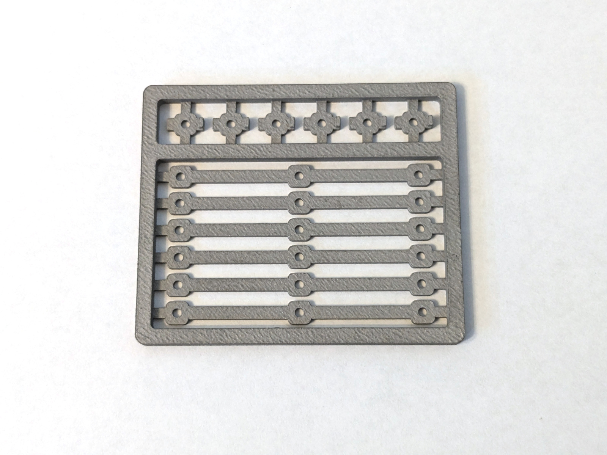
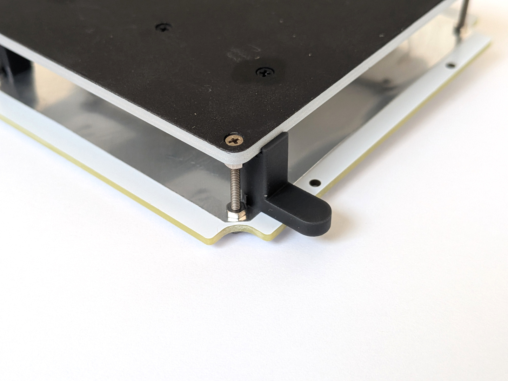

MCH-based heating head <!-- omit in toc -->
======================

- [BOM](#bom)
- [Plate top painting](#plate-top-painting)
- [Baking the paint](#baking-the-paint)
- [MCH heaters resistance matching](#mch-heaters-resistance-matching)
- [Cut SS clamps](#cut-ss-clamps)
- [Mount hotplate top parts](#mount-hotplate-top-parts)
- [Mount reflector](#mount-reflector)
- [Mount base](#mount-base)

## BOM

&nbsp; | Name | Comment
-------|------|--------
1 | Hotplate and clamps | Details below in the JLCPCB notes.
1 | [M1.6 black screws 8mm, cone cap](https://www.aliexpress.com/item/32431305716.html) | DIN965/GB819. Mount the MCH and the RTD.
2 | [MCH 70*14 2R](https://www.aliexpress.com/item/32966428374.html) | Two heaters are required; buy 5-10 to match their resistance.
3 | [PT100 RTD sensor](https://www.aliexpress.com/item/1005007238778907.html) | Temperature feedback.
4 | [Soft silicone wire, 30 AWG, white](https://www.aliexpress.com/item/4001283806251.html) | RTD wiring.
5 | [Thermal conductive paste](https://www.aliexpress.com/item/1005002400161049.html) | Use Thermal Grizzly Kryonaut. The paste must handle 300°C, so skip the cheap stuff.
6 | [Milliohm meter](https://www.aliexpress.com/item/1005006408703765.html) | For pairing the MCH heaters.
7 | [Dental diamond disk](https://www.aliexpress.com/item/4001138228461.html) | For cutting the stainless clamps. Grab a mandrel too.
8 | Black paint | High-temperature aerosol paint (grill/stove/engine type) to coat the plate top.

Hotplate (jlc3dp, CNC):

- File `hotplate_80x70x2.8.step`
- Material: Aluminum 6061.
- Surface Finish: "Bead blasting".
- Comment: "Don't deburr".

MCH/Sensor mounting (jlc3dp, SS print)

- File `ss_mch_mount.stl`
- `SLM(Metal)` process, 316L steel. Don't try `BJ(Metal)`, is will be rejected.

## Plate top painting

> **WARNING** the the difference of painted and not painted heater has not been
> checked. May be... not required.

For better heat emission the top of the heating plate should be painted black.
Use a high-temperature spray meant for barbecue, stove, or engine parts.
Shipping is often limited, so check local stores.

**Note 1.** Some paints target steel only. Test on an unused aluminum scrap
before committing.

**Note 2.** Manufacturers usually suggest baking for just a few hours, but a
full cure at high temperature can still take 2-3 days.

Tape off the plate sides, stick the plate to a sheet of A4 paper, and clean the
top with IPA. Place everything on a safe surface and spray from 30-40 cm away
in thin, even passes. A thin coat handles wide temperature swings better.

 

## Baking the paint

High-heat paints need baking once they're dry. Read the instructions on your
paint, but here are two easy approaches:

1. If you have a suitable heater or regulated power source, bake the plate right
   after the paint flashes off.
2. Bake it after the full device assembly using the built-in baking profile. Let
   the paint dry for a day and handle it gently so you don't scratch the finish
   beforehand.

Because the heads swap easily, consider building two: one for baking or
experiments and one for final use.

Many paint makers suggest hardening at about 200°C for an hour. That's not
enough. The finish feels solid at room temperature but can soften when reheated.
Try this alternative profile:

- 250°C (the max reflow working temperature) for 2-3 days (yes, days).
- 4°C/min ramp.

If you're unsure about the paint, test it on a scrap piece. Use a hobby knife to
give the surface a light scratch.

- After a couple of hours of baking it usually becomes scratch-resistant at room
  temperature, but still soft when hot.
- After 2-3 days of baking it also holds up at high temperature.

This isn't a professional coating guide - just personal experience with different
paints.

Why bake longer than the label suggests? Imagine nudging a PCB across the hot
plate in the middle of reflow. The finish shouldn't scratch that easily.

## MCH heaters resistance matching

The table uses two MCH heaters, so their resistance needs to match closely for
balanced heating. Buy a few extras so you can pair them.

Aim for roughly 2% tolerance. Use a milliohm meter (see the optional purchases
list) and connect Kelvin clips directly to the MCH pads for accurate numbers.

Buying ten heaters typically yields three or four usable pairs.

## Cut SS clamps

If you printed stainless steel clamps, cut them free from the panel. A Dremel
with thin dental diamond disks works very well and keeps the cuts precise.

 

## Mount hotplate top parts

- Apply a very thin layer of thermal paste to the heaters.
- Place the heaters on the plate and slide them about +/-0.5 mm to spread the
  paste.
- Tighten the screws with spring washers using only a light touch.

Use 8 mm black screws for the heaters and RTD, and 18 mm screws for the corners.

*Note: Do not overtighten the screws; the MCH can crack after heating!*

Once everything is mounted, solder 30 mm silicone wires to the RTD.

- Use high-temperature lead-free (217°C) paste.
- Keep the solder joints as small as possible.
- Strip and tin 1-2 mm on one end of each wire and 4-5 mm on the other. Add a
  little paste to the short ends and solder them to the RTD.
- Clean the flux with IPA to reduce heat absorption.

## Mount reflector

Use the conductor as a template to cut the foil reflector and punch the holes
with a screw.

Use spacers to set a 12 mm gap between the heater top and the reflector. For
each corner, insert the spacer, snug the top nut first, then tighten the bottom
nut (spring lock washers go underneath).

 

## Mount base

Start by soldering the connectors. They need precise alignment, so use the
conductors as jigs.

- Place the conductors on the main board corners and rest the female connectors
  on them.
- Don't push the connectors in; just align them over the male header holes.
- Position the heater base board on top and tack a few pins to lock it in
  place.
- Remove the heater base and finish soldering all the pins.

 

Now it's time for final head assembly.

- Install the 4 mm insert nuts with the 3 mm screws in the heating head base.
- Dry-fit the base, mark the MCH wires, and cut them to length.
- Remove the base and tin the MCH wires. Acid flux or an iron tip refresher
  works fine.
- Screw the head base to the reflector with the 3 mm screws.
- Solder the MCH and RTD wires.

**Note.** You may need an active flux to tin the MCH wires. Try an "iron tip
refresher", use a small amount, and clean it off afterward.

Push the pin terminals into the main PCB for alignment, place the heater on
them, and solder.

TBD image.

Wash out the flux after soldering.
